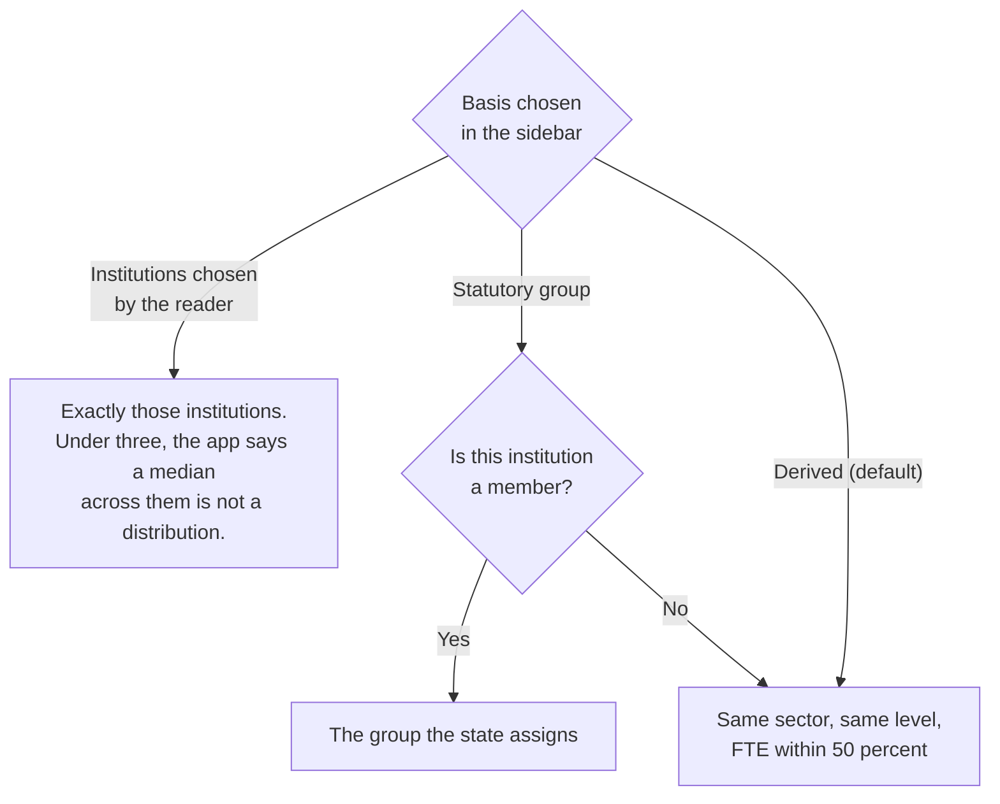
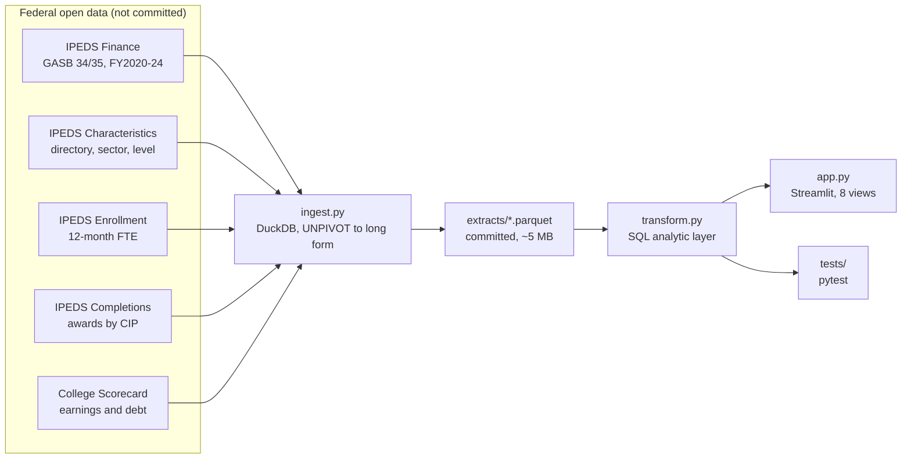

# University Management Model

A data-driven view of how U.S. public universities allocate money, what they
produce, and how they compare to institutions of similar size and type.

Built on federal open data. Every figure in this application comes from the
U.S. Department of Education. Nothing is estimated, simulated or invented.

## What it does

| View | Question it answers |
|---|---|
| **Overview** | What stands out about this institution when it is set against comparable ones? |
| **Budget allocation** | Where does an institution's money actually go, by function, in total and per full-time-equivalent student? |
| **Peer comparison** | How does that allocation compare to institutions of the same sector, level and size? |
| **Opportunities** | Which functions sit furthest from the peer median, and what is that gap worth in dollars? |
| **Reallocation planner** | If money moved between functions, where would the institution land relative to its peers? |
| **Program mix** | What does the institution actually produce, by field of study? |
| **Program returns** | What do those graduates earn, what did they borrow, and how does that compare to the same programme nationally? |
| **Revenue** | Where does the operating money come from? |
| **Compare** | How do two named institutions look on the same figures, side by side? |

Three things travel out of the application. Every table has a CSV download.
The header has a one-page institutional brief, a self-contained HTML file
that prints to PDF, carrying the headline figures, the spending position
against the current peer basis, and revenue exposure. And the address bar
always encodes the current view, institution and peer basis both, so copying
the URL shares exactly what is on screen; `?unitid=225432&peers=thecb-masters-tx`
opens the University of Houston-Downtown against its statutory Texas peer
group. When the per-year enrollment files are loaded (see
`docs/data-sources.md`), per-student figures divide each fiscal year by that
year's own enrollment and the Peer comparison view adds a position-over-time
panel; without them the application falls back to the latest snapshot and
says so.

The last two views are the point of the project. Reporting what an institution
spends is description. Naming the gaps in dollars, and letting someone test a
reallocation against them, is what makes the output usable in a decision.

One rule governs both: **the tool shows the position a decision creates, and
never predicts the outcome it produces.** A gap against peers is an
observation about how similar institutions allocate differently. It is not
evidence that one allocation performs better, and the application says so on
the page.

The two institutions pinned as defaults are the University of Cincinnati
(UNITID 201885) and the University of Houston-Downtown (UNITID 225432). Every
other U.S. institution in IPEDS remains selectable.

## How peers are chosen

Every comparison in the application depends on which institutions it is
compared against, so the basis is selectable and always stated on screen.



**Derived** is the default: same sector, same institutional level, and 12-month
FTE enrollment within 50 percent. A transparent rule a reader can check beats a
clever one they cannot.

**Statutory** uses a peer group defined by a state agency rather than by this
tool. The one implemented is the Texas Higher Education Coordinating Board's
Master's Universities group, from *Institutional Peer Groups, Public
Universities FY 2026*. It matters that the author did not choose it: a
comparison against an assigned peer group cannot be dismissed as a peer list
picked to flatter or to indict. Two reconciliations against IPEDS are recorded
in `src/config.py`, because the THECB list and the IPEDS directory do not agree
line for line: Sul Ross Rio Grande College has no separate UNITID, and the
institution THECB lists as University of Houston-Victoria became Texas A&M
University-Victoria in August 2025.

**Chosen** compares against named institutions the reader selects. This is the
question an institutional research office actually asks, which is rarely "show
me my peer group" and often "how do we look against these two in particular".

Functions the target institution does not report are excluded from every
comparison. Hospital services is the reason: only a minority of institutions
operate hospitals, so a median taken across those that do is enormous, and
comparing an institution without a hospital against it is meaningless.

## Which institutions can be selected

Only institutions this project can currently describe. That is a narrower set
than "everything in the federal directory", and the narrowing is deliberate.

**1,847 institutions are selectable**, grouped by sector:

| Sector | Institutions |
|---|---|
| Public, 2-year | 816 |
| Public, 4-year or above | 814 |
| Public, less-than-2-year | 217 |

Three conditions produce that number, each removing a real source of confusion.

**A current filing.** The institution reported expenses in the most recent
fiscal year loaded, fiscal 2024. Coverage by year is 1,949 institutions in 2020
falling to 1,911 in 2024, so an institution whose last filing was four years ago
would otherwise render as though its figures were current. Historical rows are
retained for every filer, because they belong in any peer median drawn from that
year. They just do not make an institution selectable as a subject.

**A directory record.** Fifty-six institutions filed in one of the five years
but are absent from the 2025 directory, having closed or merged in between. There
is no sector, level or enrollment figure to describe them with. A directory
snapshot and five years of filings do not describe the same population, and
pretending otherwise would quietly overstate what this covers.

**An institution rather than an administrative unit.** Sixty-three IPEDS records
are system offices, which file finance reports but enroll no students. Every
per-FTE figure for one is undefined and any comparison to a university is
meaningless, so they are excluded.

Separately, the finance survey read here is the GASB 34/35 form, which only
public institutions file. All 1,601 private nonprofit institutions and every
for-profit are therefore absent; they report under FASB, on a form this project
does not read. That is the single largest limit on coverage.

### Planned coverage

Coverage grows as more source data is added, and the intended order is:

1. **Earlier fiscal years**, extending the finance series backwards so trends
   run longer than five years.
2. **Private institutions**, which requires ingesting the FASB finance form
   (`f1a` has a sibling for private reporters) and keeping the two accounting
   bases clearly separated rather than pooled, since they are not comparable
   line for line.
3. **Additional state peer frameworks** alongside the Texas one, so the
   statutory comparison is available to institutions outside Texas.
4. **Enrollment detail**, in particular part-time share, which is the split
   that most distorts per-student spending comparisons.

Anything not yet loaded is absent from the interface rather than shown empty. A
missing institution means the data has not been ingested, not that the
institution reported nothing.

## Data sources

All public domain, all from the U.S. Department of Education.

| Source | Files | What it provides |
|---|---|---|
| IPEDS Finance (GASB 34/35) | `f1920_f1a_rv`, `f2021_f1a_rv`, `f2122_f1a_rv`, `f2223_f1a_rv`, `f2324_f1a` | Expenses by function and revenue by source, fiscal 2020 through 2024, public institutions |
| IPEDS Institutional Characteristics | `hd2025` | Directory, sector, level, size, location |
| IPEDS Derived Enrollment | `drvef122025` | 12-month full-time-equivalent and unduplicated headcount |
| IPEDS Completions | `c2025_a` | Awards conferred by 6-digit CIP code and award level |
| College Scorecard (optional) | `Most-Recent-Cohorts-Field-of-Study` | Median earnings and federal loan debt by programme and credential |

Raw data is **not** committed to this repository. It is roughly 50 MB of public
federal files that anyone can download from the
[IPEDS Data Center](https://nces.ed.gov/ipeds/datacenter/), and committing it
would make the repository large without making it more trustworthy. See
`docs/data-sources.md` for exactly which files to download and where to put
them, then run `make ingest` to rebuild every derived table.

## Architecture



Transformation logic lives in SQL against DuckDB, not in the presentation
layer. That is a deliberate choice and the same one made in the author's
professional work: pushing logic into the data engine makes the output faster,
reproducible, and testable independently of the interface.

## Running it

Python **3.11 or 3.12**. The pinned dependency versions do not publish wheels
for 3.13 or later, so a newer interpreter forces a source build. On Streamlit
Community Cloud, set the Python version under Manage app → Settings.

```powershell
python -m venv .venv
.venv\Scripts\activate
pip install -r requirements.txt
```

**Windows** (PowerShell). `make` is not available, so either call the commands
directly or use the included task runner:

```powershell
python -m src.ingest              # or  .\tasks.ps1 ingest
python -m pytest tests -q         # or  .\tasks.ps1 test
streamlit run streamlit_app.py    # or  .\tasks.ps1 run
```

**macOS and Linux:**

```bash
make ingest
make test
make run
```

`python -m src.ingest` reads the files in `Data/` and writes Parquet extracts
to `extracts/`. Expect 5,985 institutions, 5,806 enrollment records, 336,253
finance rows across five fiscal years, 201,886 completions rows and 220,960
programme rows. The finance ingest uses DuckDB's `UNPIVOT` against a mapping
table rather than a union of per-variable subqueries, because the union form
needed 190 subqueries for five years and exhausted memory.

## What it deliberately does not do

Stating this is part of the design, not a disclaimer.

- **No forecasts and no predicted outcomes.** The tool shows the position a
  decision creates. It never claims an allocation performs better. An earlier
  prototype carried a hidden yield curve behind the reallocation view; it was
  removed, because a number nobody can audit is worse than no number.
- **No estimated, simulated or imputed figures.** Every value on screen is a
  filed figure or an arithmetic combination of filed figures.
- **No causal claims.** A gap against peers is an observation that similar
  institutions allocate differently. It is not evidence that one is right.
- **No private institutions in the finance views.** They file under FASB.
- **Nothing on gender, race or international status.** Those live in a survey
  this project does not ingest. Part-time share is the enrollment split that
  distorts per-student spending comparisons, and it is the one reported.
- **Fiscal 2024 is provisional.** NCES may revise it. The year is labelled.
- **Scorecard earnings are suppressed for small cohorts.** A programme showing
  no earnings has too few graduates to publish, not zero earnings.

## Documentation

- [`docs/data-sources.md`](docs/data-sources.md): every source file, where to get it, and the variable codes used
- [`docs/methodology.md`](docs/methodology.md): how each metric is calculated and why
- [`docs/limitations.md`](docs/limitations.md): what this cannot answer, and what it would take
- [`docs/design.md`](docs/design.md): how the palette was validated and why each chart takes the form it does

## Author

Nicolas Esteban Beltran Rubio. MIT licensed.
